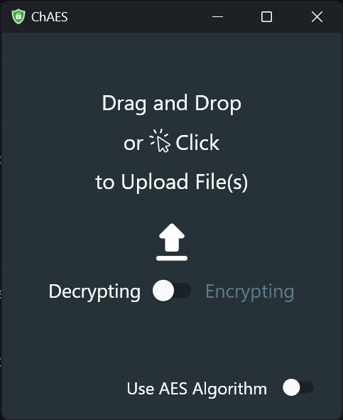
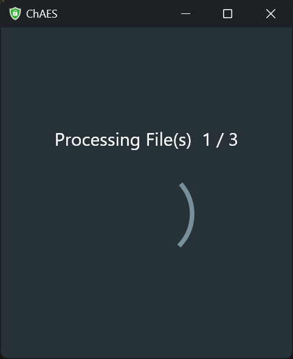

# ChAES
Windows application for encrypting files using XChaCha20 and AES-256.

## Screenshots

## Contributing

To contribute to this project, please create a fork of the main branch and make changes there. Once you are done, create a pull request. A member of the development team will review the changes as soon as possible and will integrate it if it is accepted.

Alternatively, you can also contribute by reporting issues. When doing so, please provide as much detail as possible, along with specific instructions on how to reproduce the issue.
